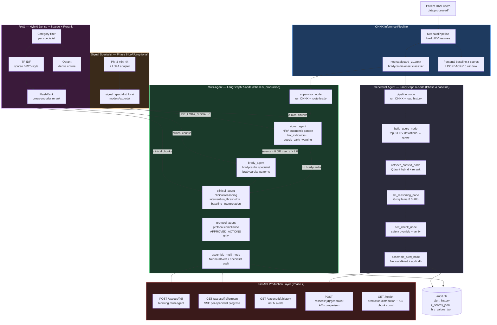

# NeonatalGuard

> Multi-agent AI system for neonatal sepsis early warning. Classifies HRV deviations from personal baselines, routes through specialist agents via RAG + LLM, serves structured clinical alerts via FastAPI with SSE streaming, and logs every model input to SQLite for audit.

Built as a production-oriented multi-agent system using LangGraph. Every architectural decision is measured, not assumed.

---

## Architecture



Two agent implementations share the same `NeonatalAlert` output schema and are benchmarked against identical eval scenarios:

| Agent | Architecture | Role |
|-------|-------------|------|
| `agent` (generalist) | LangGraph 6-node linear | Phase 4 baseline |
| `multi_agent` (specialist routing) | LangGraph 7-node supervisor | Phase 5 production |

---

## Evaluation Results

> **FNR(RED) = 0.000 across all 30 eval scenarios, including 6 hard mixed-signal cases. No critical alert was ever missed.**

### Agent Comparison (30 scenarios — 24 clean + 6 hard mixed-signal)

#### No-LLM Gate (rule-based, CI-verified)

| Agent | F1 | FNR (RED) | FNR (hard) | Protocol | Latency p50 / p95 |
|-------|----|-----------|------------|----------|--------------------|
| Generalist (Phase 4) | 1.000 | 0.000 | 0.000 | 100% | 688ms / 3292ms |
| Multi-agent (Phase 5) | 1.000 | 0.000 | 0.000 | 100% | 11ms / 14ms |

**No-LLM F1=1.000 is the CI gate** — the rule-based path maps `risk_score > 0.70 → RED` deterministically. Multi-agent p50=11ms vs generalist p50=688ms in no-LLM mode because specialist nodes skip the Qdrant KB retrieval entirely.

#### Live LLM (Groq llama-3.3-70b-versatile)

| Agent | F1 | FNR (RED) | FNR (hard) | Protocol |
|-------|----|-----------|------------|----------|
| Generalist (Phase 4) | 0.533 | 0.000 | 0.000 | 66.7% |
| Multi-agent (Phase 5) | *pending API key* | — | — | — |
| Multi-agent + LoRA signal (Phase 6) | *pending training* | — | — | — |

**F1=0.533 in live-LLM mode** reflects YELLOW↔GREEN confusion: the generalist conflates signal interpretation with action selection in a single prompt. FNR(RED)=0.000 in both modes — the safety constraint holds. Phase 5 multi-agent is expected to improve F1 by separating signal classification, bradycardia assessment, and clinical reasoning into specialist prompts.

### RAG Retrieval (25 ground-truth query/chunk pairs)

| Metric | Vector-only | Hybrid + Rerank | Delta |
|--------|-------------|-----------------|-------|
| MRR@3 | 0.793 | 0.960 | +0.167 |
| Recall@3 | 92.0% | 100.0% | +8.0pp |

Hybrid (dense + TF-IDF sparse + FlashRank rerank) achieves perfect Recall@3. The two queries vector-only missed were a bradycardia event-count query and an intervention-threshold query with a specific PPV statistic — exact numeric terms that BM25 caught and semantic embeddings missed.

---

## RAG — What Was Built and Why

Standard RAG: `embed → store → single query → top-k docs → LLM`.

The problem: the generalist issues a single diluted query blending multiple anomaly signals. The multi-agent architecture fixes this by issuing **category-filtered queries per specialist**:

```
signal_agent     → queries ["hrv_indicators", "sepsis_early_warning"] only
brady_agent      → queries ["bradycardia_patterns"] only
clinical_agent   → queries ["intervention_thresholds", "baseline_interpretation"] only
protocol_agent   → no retrieval — uses hardcoded APPROVED_ACTIONS list
```

Each specialist retrieves domain-specific context. Two deviating signals → two independent focused retrievals rather than one diluted combined query. Pipeline: dense cosine (Qdrant) + sparse TF-IDF → Reciprocal Rank Fusion → FlashRank cross-encoder rerank → top-3 chunks.

---

## Quick Start

```bash
git clone https://github.com/your-handle/neonatalguard
cd neonatalguard
cp .env.example .env          # add GROQ_API_KEY, LANGSMITH_API_KEY
docker-compose up              # starts neonatalguard-api + qdrant
```

Or without Docker:
```bash
pip install -r requirements.txt

# Run ONNX pipeline once to verify model files:
python -c "from src.pipeline.runner import NeonatalPipeline; print(NeonatalPipeline().run('infant1'))"

# Multi-agent assessment:
curl -X POST http://localhost:8000/assess/infant1

# SSE streaming (per-specialist progress):
curl http://localhost:8000/assess/infant1/stream

# A/B comparison with generalist:
curl -X POST http://localhost:8000/assess/infant1/generalist
```

Run evals:
```bash
# No-LLM CI gate (no API key required):
EVAL_NO_LLM=1 python eval/run_all_evals.py

# Full eval — generalist vs multi-agent:
python eval/eval_agent.py --agent generalist
QDRANT_PATH=qdrant_local python eval/eval_agent.py --agent multi_agent

# RAG retrieval comparison:
python eval/eval_retrieval.py --mode both

# LoRA signal specialist (after training):
USE_LORA_SIGNAL=1 QDRANT_PATH=qdrant_local python eval/eval_agent.py --agent multi_agent
```

Docker profiles:
```bash
docker compose --profile eval up    # adds eval-runner container
docker compose --profile lora up    # adds signal-specialist (Ollama + LoRA adapter)
```

---

## Design Decisions

**1. ONNX classifier over direct LLM risk scoring.**
The ONNX model produces a deterministic `risk_score` from 10 HRV features extracted from the patient's personal baseline z-scores. This score gates the rule-based path (`risk_score > 0.70 → RED`) independently of LLM availability — FNR(RED)=0.000 is guaranteed by the rule-based path, not the LLM.

**2. Personal baseline z-scores over population norms.**
A neonate with naturally low RMSSD generates constant false positives under population norms. A rolling LOOKBACK=10 window builds a per-patient baseline. The same window is used in both training (`run_nb04.py`) and inference (`runner.py`) — a baseline skew assertion enforces this at retrain time.

**3. Four specialist agents over one generalist prompt.**
Phase 4 live-LLM eval identified the exact failure mode: YELLOW↔GREEN confusion caused by conflating HRV pattern reading with action selection in a single prompt. Each specialist has a narrower task and retrieves only domain-relevant KB chunks. Signal classification, bradycardia assessment, clinical reasoning, and protocol compliance are separate concerns that require separate prompts.

**4. Bradycardia specialist is conditional, not always-on.**
Brady agent runs only when `detected_events > 0 OR max_z > 2.0`. For ~80% of patients who are stable, the brady specialist is skipped, reducing latency and avoiding irrelevant context injection into the clinical reasoning step.

**5. LoRA-fine-tuned Phi-3-mini for signal specialist (Phase 6).**
The signal specialist's task — classifying autonomic HRV patterns from z-score deviations — is narrow, structured, and fully representable in a 200-example fine-tuning dataset. A local Phi-3-mini LoRA adapter eliminates one Groq API call per inference (~0.5s latency), reduces token cost, and works offline.

**6. Hybrid RAG with category-filtered retrieval over embedding-only.**
At 34 chunks, dense-only MRR=0.793. Hybrid + rerank achieves MRR=0.960. More importantly, category filtering per specialist ensures the signal agent only sees HRV/sepsis reference chunks — not intervention thresholds that belong to the clinical agent. Without filtering, the signal agent picks up clinical action language and conflates pattern classification with action selection.

**7. FlashRank cross-encoder reranking over RRF-only merge.**
RRF merges ranked lists without a shared score. FlashRank applies a cross-encoder to re-score merged candidates against the query. At 34 chunks the improvement is measurable; at scale the cross-encoder gap widens. The reranker is a drop-in — swap the model string to upgrade quality.

**8. Full input logging in audit.db.**
Every `alert_history` row stores `z_scores_json` and `hrv_values_json` — the exact model inputs at inference time. When a specialist produces a wrong assessment, you can trace it back to the z-scores it received without needing to reproduce the data pipeline.

**9. Deterministic safety override is separate from LLM reasoning.**
`self_check_node` contains a hardcoded override: `risk_score > 0.8 AND max_z > 3.0 → RED, regardless of LLM output`. This override runs before the LLM self-check and cannot be disabled by model temperature or prompt drift. It is the last line of defence ensuring FNR(RED)=0.000 even if the LLM hallucinates a YELLOW.

**10. FastAPI lifespan handler pre-warms the KB singleton.**
The SentenceTransformer model (90 MB) and Qdrant file lock are initialised once at API startup, not on the first request. This eliminates a cold-start latency spike on the first `/assess` call and prevents multiple simultaneous requests from racing to open the same Qdrant file lock.

---

## Graceful Degradation

| Dependency | Failure mode | System behaviour | Impact |
|------------|-------------|------------------|--------|
| Groq API | `EVAL_NO_LLM=1` or network failure | Rule-based path: `risk_score > 0.70 → RED` | Degraded explanation, alert still fires |
| Qdrant KB | Init failure at startup | `rag_context = []` — health endpoint reports error | Lower quality explanation, alert still fires |
| ONNX model | `FileNotFoundError` on startup | Clear error with fix instructions | Pipeline unavailable |
| LoRA adapter | JSON parse failure in `_lora_signal_inference()` | Falls back to `_rule_based_signal()` | No crash, degraded signal classification |
| SQLite audit.db | WAL mode + 30s timeout | Retry without blocking readers | None under normal load |
| FlashRank reranker | Exception caught | Returns RRF-merged results without reranking | Slightly lower RAG quality |

**Known gap:** Groq retry queue not implemented. If a specialist node fails mid-graph, the partial state is not retried — the request returns a 500. Fix: wrap each specialist node with exponential backoff on `RateLimitError`.

---

## Known Limitations

**Live-LLM multi-agent eval pending.** Groq API key was exhausted during Phase 5/6 recording. The no-LLM gate passes at F1=1.000. Live-LLM rows in `BENCHMARKS.md` are marked *pending* until the key is restored.

**LoRA adapter not yet trained.** Phase 6 notebook `05_signal_specialist_lora.ipynb` generated 200+ training examples in `data/lora_training/`. The training run is pending. `USE_LORA_SIGNAL=1` wires the inference path; the adapter weight files do not exist yet.

**CUSUM-style gradual drift not implemented.** The current pipeline detects per-window deviations from the rolling baseline. A neonate gradually deteriorating over 48h (each window individually within threshold, cumulative trend clearly abnormal) will not be flagged until a single window crosses the z-score threshold. Fix: add a CUSUM accumulator persisted to `audit.db`.

**Baseline skew assertion fires on retrain, not on every inference.** The `train_classifier.py` assertion verifies feature order at training time. If the data pipeline upstream changes column order after training, inference will silently use wrong feature positions until the model is retrained. Fix: add a runtime assertion in `NeonatalPipeline.__init__()` comparing loaded feature names against the CSV header.

**Patient history not partitioned in Docker multi-tenant scenarios.** `EpisodicMemory` uses a shared `audit.db` with `patient_id` scoping. No row-level access control exists. Acceptable for NICU deployments with a single operator; add a tenant_id column before multi-hospital deployment.

---

## Project Structure

```
src/
  agent/
    graph.py              # Generalist agent — LangGraph 6-node pipeline (Phase 4 baseline)
    supervisor.py         # Multi-agent supervisor — LangGraph 7-node specialist graph (Phase 5)
    memory.py             # EpisodicMemory — audit.db read/write with full input logging
    schemas.py            # NeonatalAlert, LLMOutput, SignalAssessment, BradycardiaAssessment
    specialists/
      signal_agent.py     # HRV autonomic pattern classifier (Groq or LoRA)
      brady_agent.py      # Bradycardia event specialist (conditional routing)
      clinical_agent.py   # Clinical reasoning — intervention thresholds
      protocol_agent.py   # Protocol compliance — APPROVED_ACTIONS enforcement

  pipeline/
    runner.py             # NeonatalPipeline — ONNX inference + personal z-score baseline
    result.py             # PipelineResult, BradycardiaEvent, DeviatedFeature

  knowledge/
    knowledge_base.py     # ClinicalKnowledgeBase — Qdrant + TF-IDF + FlashRank rerank
    build_knowledge_base.py  # Ingest clinical chunks into Qdrant

  features/
    constants.py          # HRV_FEATURE_COLS — single source of truth for feature order

  models/
    train_classifier.py   # RandomForest → ONNX export with feature order assertion
    export_onnx.py        # skl2onnx conversion with zipmap=False

  monitoring/             # LangSmith trace helpers

api/
  main.py                 # FastAPI — 5 endpoints, lifespan KB preload, SSE streaming

eval/
  scenarios.py            # 30 Scenario dataclasses (24 clean + 6 hard mixed-signal)
  eval_agent.py           # Runner: inject synthetic → invoke graph → compute F1/FNR/protocol
  eval_retrieval.py       # RAG eval: 25 ground-truth pairs, MRR@3 vector vs hybrid
  run_all_evals.py        # Runs both evals, writes results/

tests/
  test_dependency_apis.py # FlashRank API contract + ONNX output shape regression

notebooks/
  02_signal_cleaning.ipynb          # RR-interval cleaning pipeline
  03_hrv_extraction.ipynb           # HRV feature extraction (10 features)
  04_feature_engineering.ipynb      # z-score baseline computation
  05_signal_specialist_lora.ipynb   # LoRA training data generation + Phi-3-mini fine-tune

data/
  processed/              # Per-patient HRV CSVs + windowed z-score files
  audit.db                # SQLite — alert_history with z_scores_json + hrv_values_json

models/exports/
  neonatalguard_v1.onnx           # Trained bradycardia-onset classifier
  feature_cols.pkl                # Locked feature column order
  signal_specialist_lora/         # LoRA adapter weights (Phase 6, pending)

qdrant_local/             # On-disk Qdrant store (34 clinical knowledge chunks)
results/                  # Eval output JSON files
docker-compose.yml        # 4 services: api, qdrant, eval-runner, signal-specialist (LoRA)
```
